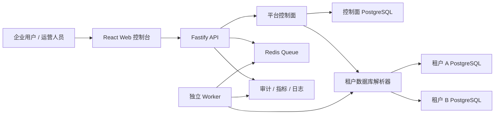

# Sale Compass

[](https://github.com/onebu123/xianyu/actions/workflows/ci.yml)
[](https://github.com/onebu123/xianyu/releases)
[](https://nodejs.org/)
[](./LICENSE)

Sale Compass 是一个面向闲鱼商家和企业客户的运营后台底座，目标是建设类似企业商家运营平台的能力：租户管理、店铺接入、订单中心、售后中心、资金中心、AI 客服、AI 议价、开放平台、队列 Worker、审计安全和生产运维。

当前版本：`v2.0.0`

交付定位：企业级 SaaS + 私有化双模式正式基线。

> 本项目不提供绕过闲鱼风控、验证码、安全策略或平台规则的能力。真实生产接入必须基于合法账号、客户授权和合规边界。

## 你可以用它做什么

- 管理多个企业租户，每个企业客户对应一个租户。
- 在一个租户下管理多个闲鱼店铺、多个成员和多个经营分组。
- 统一查看订单、售后、资金、履约、商品和经营数据。
- 使用 AI 客服和 AI 议价辅助处理会话与转化。
- 通过开放平台提供 API Key、Webhook 和外部系统集成能力。
- 用 PostgreSQL、Redis、队列、Worker、审计和监控支撑企业级部署。

## 架构总览



## 部署模式

| 模式 | 适用场景 | 数据库 | 说明 |
| --- | --- | --- | --- |
| `private` | 单客户私有化部署、本地演示、VPS 部署 | SQLite 兼容或 PostgreSQL | 保留旧单租户登录链路，企业正式环境建议使用 PostgreSQL。 |
| `saas` | 多企业客户 SaaS 平台 | 控制面 PostgreSQL + 每租户独立 PostgreSQL | 平台账号登录后选择租户，业务接口只接受租户作用域会话。 |

## 核心能力

| 模块 | 能力 |
| --- | --- |
| 租户控制面 | 租户创建、暂停、恢复、查询、开通任务、成员管理。 |
| 认证与权限 | 平台账号、租户成员关系、租户作用域会话、管理员 MFA、密码策略。 |
| 店铺运营 | 多店铺接入、授权会话、登录态维护、凭据校验、店铺健康检查。 |
| 交易中台 | 订单、售后、资金、履约、卡密、直充、自有货源。 |
| AI 工作台 | AI 客服、AI 议价、真实 IM 同步、人工接管、任务化处理。 |
| 开放平台 | API Key、Webhook、调用审计、白名单、文档版本管理。 |
| 后台任务 | Redis 队列、独立 Worker、幂等键、重试策略、死信状态。 |
| 生产治理 | 健康检查、Prometheus 指标、结构化日志、备份恢复、回滚和事故响应。 |

## 技术栈

| 层级 | 技术 |
| --- | --- |
| 后端 | Node.js 22、TypeScript、Fastify、Zod、JWT |
| 前端 | React、TypeScript、Vite、Ant Design、React Query |
| 数据 | PostgreSQL、SQLite 兼容层、数据库迁移 Runner |
| 任务 | Redis、队列抽象、独立 Worker |
| 测试 | Vitest、ESLint、Playwright 冒烟测试 |
| 交付 | Docker Compose、GitHub Actions、OpenAPI、发布包清单 |

## 快速开始

```bash
cp .env.example .env
npm install
npm run dev
```

默认访问地址：

| 服务 | 地址 |
| --- | --- |
| Web | `http://127.0.0.1:5173` |
| API | `http://127.0.0.1:4300` |

## 私有化运行

```bash
APP_DEPLOYMENT_MODE=private
npm run build
npm run preflight
npm run start
```

常用运维命令：

```bash
npm run db:inspect
npm run db:doctor
npm run smoke:release
```

## SaaS 运行

SaaS 模式至少需要控制面数据库、租户业务数据库配置和 Redis：

```bash
APP_DEPLOYMENT_MODE=saas
CONTROL_PLANE_DATABASE_URL=postgres://...
TENANT_BUSINESS_DATABASE_URL_TEMPLATE=postgres://...
REDIS_URL=redis://...
```

启动 API 和 Worker：

```bash
npm run build
npm run start
npm run worker -w server
```

## Docker 部署

```bash
cp .env.example .env
docker compose up -d --build
curl http://127.0.0.1:4300/api/health
```

VPS 环境可叠加：

```bash
docker compose -f docker-compose.yml -f docker-compose.vps.yml up -d --build
```

Nginx 示例：[deploy/nginx.sale-compass.conf](./deploy/nginx.sale-compass.conf)

## 发布与验收

正式 v2 发布命令：

```bash
npm run release:v2
```

该命令会串行完成：

```text
lint -> test -> build -> private smoke -> SaaS smoke -> PostgreSQL smoke
-> Redis queue smoke -> Web smoke -> Worker dry-run -> release package
```

发布包输出：

```text
output/releases/sale-compass-v2.0.0-<timestamp>/
output/releases/sale-compass-v2.0.0-<timestamp>.zip
```

当前正式发布页：[v2.0.0](https://github.com/onebu123/xianyu/releases/tag/v2.0.0)

## 目录结构

```text
.
├── server/                 # Fastify API、数据库、任务、Worker
├── web/                    # React 管理后台
├── docs/                   # 架构、部署、验收、运维和交付文档
├── deploy/                 # Nginx 等部署配置
├── scripts/                # 冒烟、打包、迁移和发布脚本
├── .github/workflows/      # CI 与 Release 工作流
└── output/releases/        # 本地发布产物
```

## 关键文档

| 文档 | 说明 |
| --- | --- |
| [docs/v2-release-notes.md](./docs/v2-release-notes.md) | v2 发布说明。 |
| [docs/v2-architecture-blueprint.md](./docs/v2-architecture-blueprint.md) | v2 架构蓝图。 |
| [docs/v2-engineering-baseline.md](./docs/v2-engineering-baseline.md) | 工程基线与验收标准。 |
| [docs/saas-foundation.md](./docs/saas-foundation.md) | SaaS 控制面与租户模型。 |
| [docs/deployment.md](./docs/deployment.md) | 部署说明。 |
| [docs/production-acceptance.md](./docs/production-acceptance.md) | 生产验收清单。 |
| [docs/customer-delivery-handbook.md](./docs/customer-delivery-handbook.md) | 客户交付手册。 |
| [docs/backup-restore-runbook.md](./docs/backup-restore-runbook.md) | 备份恢复手册。 |
| [docs/incident-response-runbook.md](./docs/incident-response-runbook.md) | 事故响应手册。 |

## 真实闲鱼接入前置条件

- 客户提供合法闲鱼账号、店铺授权和测试店铺。
- 明确自动化操作范围、频率限制、风控责任和人工介入机制。
- 先完成小流量试运行，再扩大到正式多店铺生产使用。
- 配置生产 PostgreSQL、Redis、备份、日志、监控和告警。
- 启用管理员 MFA、强密码策略、密钥加密和最小权限账号。

## License

本项目使用 [MIT License](./LICENSE)。
