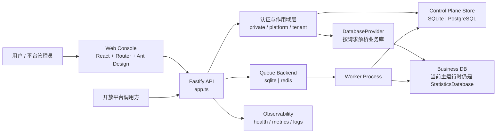
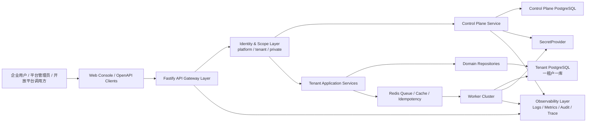
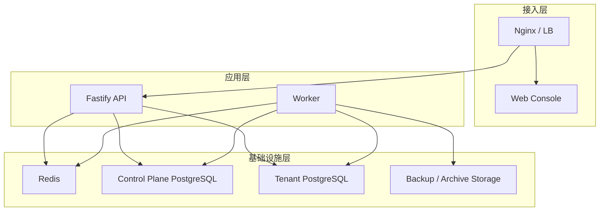

# v2.0 架构蓝图

## 目标

这份蓝图用于把当前仓库从“模块化单体 + SaaS 基线”推进到“企业级 SaaS 正式版”。

它回答 4 个问题：

1. 当前系统真实是怎么跑的
2. `v2.0` 的目标架构应该长什么样
3. 每个业务域应该拆到什么边界
4. 后续实施顺序应该怎么排

---

## 现状架构

当前系统本质上是一个：

- React 单页控制台
- Fastify 单体 API
- 独立 Worker 进程
- 控制面与业务面分层
- 多租户数据库解析入口已具备
- 业务运行时仍主要依赖 SQLite 语义

### 现状拓扑

### 当前运行层

- 前端统一入口：`web/src/App.tsx`
- 主布局：`web/src/layout/AppLayout.tsx`
- 后端启动入口：`server/src/server.ts`
- 应用装配中心：`server/src/app.ts`
- Worker 入口：`server/src/worker.ts`

### 当前数据层

- 控制面存储抽象：`server/src/control-plane-store.ts`
- 租户业务库解析：`server/src/database-provider.ts`
- 主业务数据库实现：`server/src/database.ts`

### 当前任务层

当前已经从 API 进程迁出的任务包括：

- 自动备份
- 店铺健康检查
- 浏览器续登
- 商品/订单同步
- AI 客服同步
- AI 议价同步
- 卡密/直充履约派发

当前队列后端支持：

- `sqlite`
- `redis`

但“正式生产运行时”还没有完全从 SQLite 状态扫描迁移到外部 Redis 队列治理模型。

### 当前安全与治理层

当前已经具备：

- 平台与租户双阶段认证
- MFA 基础能力
- 审计日志
- Prometheus 指标
- 健康检查
- 开放平台签名接口基础能力

### 当前主要瓶颈

当前最大的结构性问题仍然集中在两个超大单体文件：

- `server/src/app.ts`
- `server/src/database.ts`

这意味着：

- 路由、鉴权、编排、业务逻辑仍耦合
- 业务域边界不够清晰
- PostgreSQL 正式运行时替换成本高
- 队列和 Worker 的可替换性还不够彻底

---

## v2.0 目标架构

`v2.0` 不追求“全微服务”，目标是：

- 控制面独立
- 租户业务面清晰分域
- 业务库正式运行在 PostgreSQL
- Redis 成为统一任务队列和短状态基础设施
- API 与 Worker 明确分责
- 日志、指标、审计、密钥治理形成闭环

### 目标拓扑

### 目标设计原则

- 单体优先，分域清晰，不盲目拆微服务
- 控制面与租户业务面必须分离
- 一租户一业务库
- API 只做鉴权、编排、入队、查询
- 长耗时任务只在 Worker 执行
- 外部集成只通过标准 OpenAPI / Webhook / SecretProvider 接入

---

## 模块边界

`v2.0` 建议按下面 12 个核心域收敛。

### 1. Identity & Auth

职责：

- 平台登录
- 租户选择
- 私有化单租户兼容登录
- Token 签发与刷新
- MFA 验证
- 密码策略与轮换

输入：

- `/api/auth/*`

输出：

- 平台会话
- 租户会话
- 审计记录

### 2. Tenant Control Plane

职责：

- 租户创建、暂停、恢复
- 租户配额、套餐、状态
- 平台账号与租户成员关系
- 租户开通任务
- 租户数据库元数据

存储：

- `Control Plane PostgreSQL`

### 3. Store Access Center

职责：

- 多店铺接入
- 授权会话
- 登录态托管
- 店铺分组、标签、负责人
- 店铺健康检查
- 浏览器续登

说明：

- 这是多店铺运营中心的底座域

### 4. Product Center

职责：

- 商品列表
- 草稿、待发布、销售中、下架状态机
- 批量发布/下架/同步
- 库存与编码管理

### 5. Order Center

职责：

- 订单同步
- 订单状态流转
- 批量发货
- 订单异常队列
- 订单导出

### 6. After-sale Center

职责：

- 退款 / 退货退款 / 拒绝退款
- 售后状态机
- 超时提醒
- 售后与订单/资金联动

### 7. Fulfillment Center

职责：

- 卡密自动发货
- 直充自动发货
- 失败补发
- 人工接管
- 幂等、重试、死信

说明：

- 所有履约任务都必须只通过队列消费执行

### 8. Fund Center

职责：

- 资金账户
- 账单、流水、对账
- 提现、结算、退款联动
- 利润口径计算

### 9. AI Service Center

职责：

- AI 客服会话
- 知识库
- 自动回复
- 人工接管

### 10. AI Bargain Center

职责：

- 议价策略
- 黑名单
- 会话记录
- 风险保护

### 11. Open Platform

职责：

- 应用管理
- 签名校验
- 白名单
- 调用日志
- OpenAPI 文档
- Webhook

### 12. Observability & Ops

职责：

- 健康检查
- Metrics
- 结构化日志
- 审计日志
- 告警
- 备份与恢复
- 运维巡检

---

## 数据架构

### 控制面数据库

控制面数据库只放：

- `platform_users`
- `tenants`
- `tenant_memberships`
- `tenant_provisioning_jobs`
- `secret_refs`
- `control_plane_audit_logs`

禁止放入：

- 订单
- 商品
- 售后
- 店铺业务数据

### 租户业务数据库

每个租户一个独立 PostgreSQL 业务库，放入：

- 店铺
- 商品
- 订单
- 售后
- 资金
- 履约
- AI
- 租户内审计与运行状态

### 密钥治理

敏感凭据统一通过 `SecretProvider` 抽象访问：

- 当前阶段可落地为“控制面密文 + 引用”
- 下一阶段可接 KMS / Secret Manager

禁止业务代码直接散落读取：

- OpenAPI 密钥
- 第三方平台密钥
- 登录态密文
- AI Provider 密钥

---

## 部署架构

### Private 模式

用于私有化交付：

- 一个 API
- 一个 Worker
- 一个控制面实例可关闭
- 一个业务库

### SaaS 模式

用于多租户平台：

- Web Console
- API
- Worker
- Control Plane PostgreSQL
- Tenant PostgreSQL 集群
- Redis

### 建议部署边界

---

## 实施顺序

### 第 1 阶段：把单体装配层收紧

目标：

- `app.ts` 只保留路由注册、鉴权装配、运行时装配
- 业务逻辑下沉到 service / repository / runtime

优先顺序：

1. Store Access
2. Order Center
3. After-sale Center
4. Fund Center
5. Open Platform

### 第 2 阶段：业务库正式 PostgreSQL 化

目标：

- `StatisticsDatabase` 退出正式运行时
- SQLite 只保留 demo / 本地 / 迁移源用途

交付：

- 业务库 PostgreSQL provider
- SQLite -> PostgreSQL 离线迁移
- 迁移校验与回滚工具

### 第 3 阶段：队列与 Worker 收口

目标：

- 所有长任务只走 Redis 队列
- API 不再主动执行核心后台作业

交付：

- 统一 `job envelope`
- 幂等键
- 重试
- 死信
- 任务审计

### 第 4 阶段：多店铺运营中心收口

目标：

- 一个租户稳定管理多店铺
- 分组、负责人、批量治理全部可用

### 第 5 阶段：开放平台收口

目标：

- 应用、文档、签名、Webhook、调用日志闭环

### 第 6 阶段：安全与可观测性收口

目标：

- MFA、审计、密钥治理、指标、日志、告警形成正式闭环

---

## v2.0 收口标准

要称为 `v2.0`，至少满足：

- 控制面正式运行在 PostgreSQL
- 租户业务库正式运行在 PostgreSQL
- Redis 成为正式队列后端
- API 与 Worker 职责分离
- 多店铺运营中心可稳定使用
- 开放平台可对接第三方系统
- MFA、密钥治理、指标、审计、备份恢复闭环
- `release:v2` 全链路验收通过

---

## 当前最优先的三刀

1. 把 `database.ts` 继续按业务域拆薄
2. 把业务库正式切到 PostgreSQL provider
3. 把 Redis 队列从“可切换”升级成“正式默认运行时”
